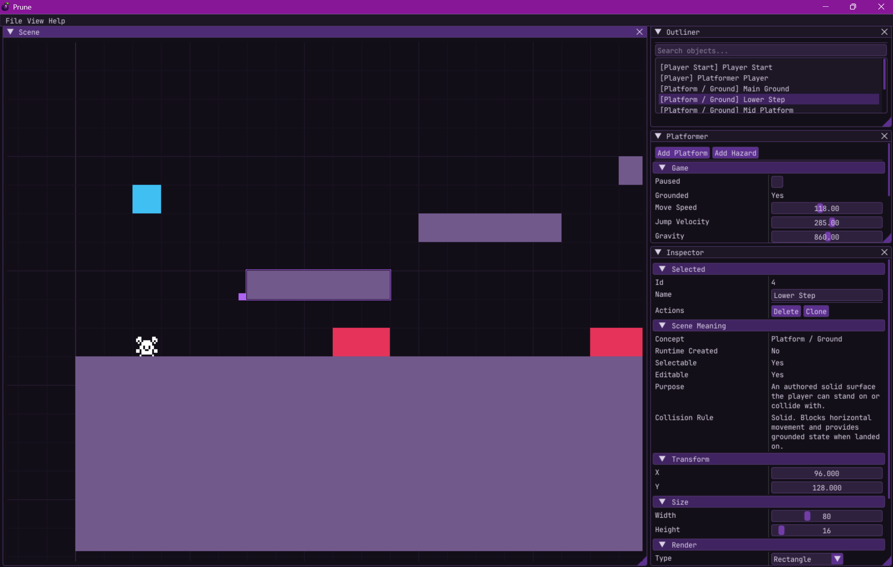
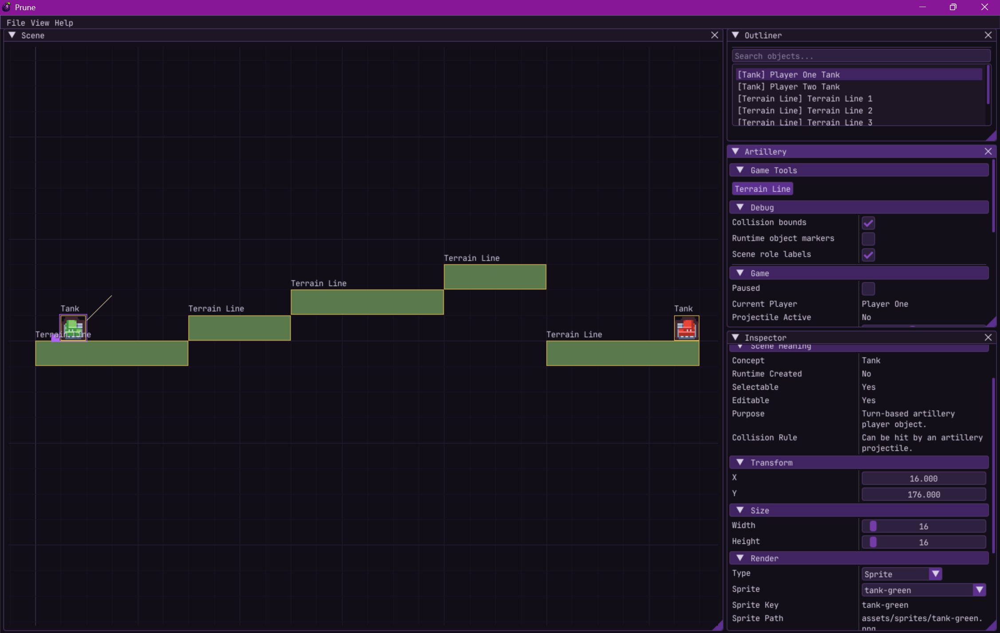
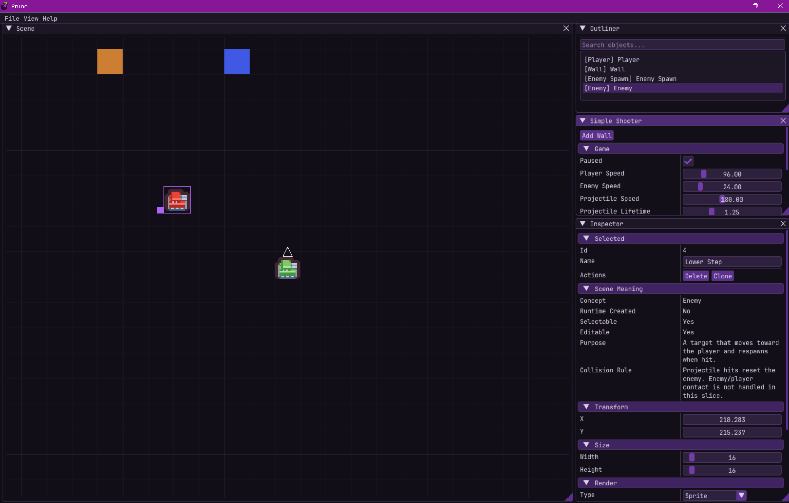

[](https://github.com/deanblackborough/Prune/actions/workflows/build.yml)

# Prune


Prune is a C++23 live 2D editor/runtime prototype built with SDL2, SDL2_image, Dear ImGui, and yaml-cpp.

It is not trying to be a traditional engine where editing happens in one mode and gameplay happens in another. The goal is a play-and-build system where the editor remains part of the runtime.

Different scene types can share the same editor shell while defining their own behaviour, tools, panels, inspectors, object semantics, defaults, and save data.

> **Save compatibility warning**
>
> Prune is still pre-release. Existing `.yml` scene files may break while the object model, scene descriptors, behaviour ids, concept metadata, and scene-specific save data are being shaped.
>
> Save compatibility will matter later. For now, the priority is getting the scene model and editor/runtime architecture right.

## Why this exists

My earlier attempt, [prune-2d](https://github.com/deanblackborough/prune-2d), leaned too far towards building generic engine pieces first and hoping the editor and game would appear later.

Prune is take two.

The goal is to build the editor, runtime, and interaction model together from the start. That means solving editor problems early: viewport ownership, input focus, picking, object inspection, save/load, scene-specific behaviour, scene-specific tooling, and the boundary between generic editor tools and scene-owned tools.

## Core idea

Prune is built around a shared editor shell with scene-specific behaviour layered on top.

The shared side owns:

- Viewport
- Grid
- Camera foundations
- Selection
- Outliner
- Generic inspector
- Basic object editing
- Rendering foundations
- Save/load foundations
- Scene creation/loading flow

Each scene type owns:

- Object roles and semantics
- Runtime behaviour
- Scene-specific tools
- Scene-specific panels
- Scene-specific inspector sections
- Scene-specific object creation rules
- Scene-specific default layout
- Scene-specific save data

A simple shooter, platformer, artillery/tank game, card scene, or puzzle scene should be able to reuse most of the editor and general tools whilst still defining the parts that make that particular scene type unique.

The current goal is not to build complete games. The goal is to prove that multiple small game slices can coexist inside the same live editor/runtime without turning the scene layer into one large conditional mess.

As the project develops, the game slices will improve and expand. Tools will be added as scenes need them; as those tools arrive, game slice quality, features, and editor UX will improve.

### Platformer editor and runtime



### Artillery editor and runtime



### Simple shooter editor and runtime



## Prune is not...

Prune is not currently trying to be:

- A general-purpose commercial game engine
- A plugin-based editor framework
- An ECS experiment
- A complete platformer engine
- A complete shooter engine
- A complete artillery engine
- A stable scene file format

The project is still in the phase where concrete slices are being used to discover the right editor/runtime boundaries.

I have a [DECISIONS.md](DECISIONS.md) file which explains some of the choices I have made, and more importantly why I have rejected to do some things.

## Current architecture direction

The project is moving towards this rule:

> A new scene type should only need to define what makes it different.

That means a scene type should not need to reimplement generic viewport access, camera access, object manager access, grid access, generic rendering flow, generic editor interaction, or basic save/load plumbing.

The current architecture is intentionally not a plugin system, not an ECS, and not a general-purpose engine API. The code is still being shaped around concrete scene slices first.

The next important step is stronger object semantics: the editor needs to understand what an object means in the active scene, not just that it has a rectangle, colour, transform, and runtime behaviour string.

## Where we are now

Prune has moved beyond a single-scene prototype. The project now has a shared editor/runtime foundation with three scene slices proving that different game types can reuse the same editor while owning their own behaviour, semantics, tuning, inspector sections, and save data.

The current focus is no longer "can a scene run?" It is now "can scenes be edited clearly and safely while the runtime remains live?"

Prune currently has:

- Dedicated ImGui scene viewport
- Shared editor camera and game camera foundations
- Grid rendering and snapping
- Live object selection
- Selected-object outline and first transform handle
- Handle-based object movement for authored movable objects
- Runtime object protection by default
- Outliner and generic inspector panels
- Scene-specific inspector sections
- Scene-aware object concepts (scene roles) for selection, editability, movement, runtime-only objects, and collision meaning
- YAML scene save/load
- Scene factory creation and scene-type loading from save files
- Rectangle and sprite rendering
- Basic sprite resource map
- Shared scene renderer, interaction, camera, state, collision, and serialization pieces
- Shared `WorldScene` foundation for scene types
- Platformer scene slice
- Artillery game slice
- Simple Shooter scene slice

The first real editor tooling pass was completed when I added the transform gizmo. It was intentionally small: selected authored objects show a visible manipulation affordance, and movement starts from the handle rather than from arbitrary object-body dragging.

This mattered because it shifted Prune from "objects can be edited through panels" towards "the viewport itself is becoming an editor surface" which is what users will expect from a live editor/runtime.

## Editor model

Prune separates shared object editing from scene-specific behaviour.

The generic inspector shows shared object data and scene meaning; the scene-specific inspectors show what that object does in the current scene type.

- Scene meaning: What this object is in the context of the scene, authored or created by the runtime, selectable, editable, the purpose and collision rules.
- Scene type section: What the object is doing in the scene; for example, if it is the player, are they ready to shoot, is there a cooldown, what is the current speed, and so on.

## Current scene slices

The current scenes are proof slices. They are deliberately small, but they exercise different parts of the editor/runtime boundary.

They are not intended to be complete games yet, maybe one day.

### Platformer

The Platformer slice currently proves:

- Gravity
- Jumping
- Ground checks
- Solid platforms
- Hazards
- Player reset
- Scene-specific tuning panel
- Scene-specific save/load data

### Artillery

- Two player
- Individual player state
- Randomised levels (3 defined, random on reset)
- Game reset on tank collision
- Scene-specific tuning panel
- Scene-specific save/load data

### Simple Shooter

The Simple Shooter slice currently proves:

- Player movement
- Facing direction
- Shooting
- Runtime bullet objects
- Enemy movement
- Bullet/enemy collision
- Runtime cleanup
- Scene-specific tuning panel
- Scene-specific save/load data

## Near-term focus

The scene-type model is now strong enough to begin the first real editor tooling pass.

The immediate focus is proving that viewport tools can operate safely on scene objects without bypassing scene ownership rules.

Current priorities:

- [ ] Command model for editor changes
- [ ] Undo/Redo on top of the command model
- [ ] Multi-select
- [ ] Tool mode state
- [ ] Scale tool
- [ ] Basic audio hooks

My development plan is tracked in [NOTES.md](NOTES.md), check the file for more details on what each of these points mean as well as what is included - this is what I will be working on in the next development phase.

## Ready for users when...

I will consider Prune ready for users when the below is ready, this is the minimum I think users expect from a live editor/runtime prototype:

- Open app.
- Pick a scene type.
- Select object in viewport.
- Move with handle.
- Resize with scale tool.
- Duplicate it.
- Delete it.
- Undo/redo all of that.
- Save.
- Load.
- Behaviour still works.
- Runtime objects do not get accidentally edited or saved.

## Documentation stance

It is too early for heavy internal documentation.

Useful documentation now:

- [README.md](README.md) explaining the project goal and current architecture direction
- [NOTES.md](NOTES.md) tracking next architecture work
- Short comments where C++ intent is not obvious
- [Scene-type checklist](docs/SCENE_TYPE_CHECKLIST.md)

Too early:

- Full API docs
- Deep class documentation
- Plugin author guide
- Long tutorials

The code is still moving too quickly. Documentation should help decision-making without fossilising unfinished architecture.

## Build

Prune currently targets Windows and is built with CMake, vcpkg, and a C++23-capable compiler.

The project may build on other platforms later, but Windows is the only platform currently verified.

### Confirmed environment
- Windows
- Visual Studio 2022/2026 / MSVC
- CMake
- vcpkg
- C++23
- Ninja or the Visual Studio CMake generator

### Dependencies

Dependencies are managed through vcpkg.json.

Prune currently uses:

- SDL2
- SDL2_image
- Dear ImGui
- yaml-cpp

Dear ImGui is included in the repository under external/, while the remaining third-party libraries are resolved through vcpkg.

### Configure

From the repository root (Powershell examples):

```powershell
cmake -B build -S . `
  -DCMAKE_TOOLCHAIN_FILE=C:/dev/vcpkg/scripts/buildsystems/vcpkg.cmake
 ```

### Build
```powershell
cmake --build build
```

For a release build:

```powershell
cmake --build build --config Release
```

### Run

The executable is created in the CMake build output directory. The exact path depends on the generator used.

For Visual Studio generators, the executable will usually be under:

```powershell
build/Release/Prune.exe
```

or:

```powershell
build/Debug/Prune.exe
```

### Notes

- The project is currently developed and tested on Windows.
- The GitHub Actions workflow also builds the project on Windows.
- Other platforms are not intentionally unsupported, but they are not verified yet.
- If CMake cannot find SDL2, SDL2_image, or yaml-cpp, check that the vcpkg toolchain file path is correct.

## Acknowledgements

- [SDL2](https://www.libsdl.org/) — windowing, input, and rendering foundation
- [Dear ImGui](https://github.com/ocornut/imgui) — editor UI
- [yaml-cpp](https://github.com/jbeder/yaml-cpp) — scene save/load
- [SDL2_image](https://github.com/libsdl-org/SDL_image) — sprite loading
- [The Cherno](https://www.youtube.com/@TheCherno) — C++ game engine architecture and editor design inspiration
- [Kenny](https://kenney.nl/) — free game assets for prototyping

## Licence

MIT — see [LICENSE](LICENSE)
